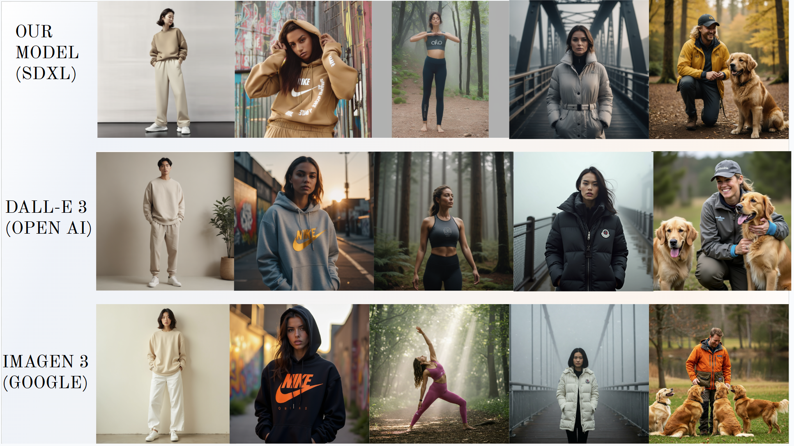

# 📑 E-Commerce Product Image Generation Using Stable Diffusion XL

This project presents a scalable, AI-driven approach to generate branded clothing images for e-commerce using **Stable Diffusion XL (SDXL)** fine-tuned with **Low-Rank Adaptation (LoRA)** on the **KREAM BLIP Captions Dataset**.

> 📄 For full technical documentation, detailed methodology, and results analysis, refer to our [Project Report](https://docs.google.com/document/d/1RDH5nS9AvnCWSiVsb4QwntLh7OCS1cHPT7U00GTSIK0/edit?usp=sharing).

---
## Demo Video

Watch the demo of the project below:

[Watch Demo Video](Demo_video/SDXL%20Fine%20tuning%20project%20demo.mp4)

## 🌟 Objective

Manual product photography is expensive and time-consuming. We fine-tuned pre-trained diffusion models (SD 1.4 and SDXL) to **automate generation of ultra-HD, semantically accurate branded images**. Our approach enables scalable creation of lifestyle and catalog images from just text prompts.

---

## 🏗️ Model Architecture

### ✅ SDXL + LoRA Fine-Tuning

We fine-tuned the [Stable Diffusion XL Base 1.0](https://huggingface.co/stabilityai/stable-diffusion-xl-base-1.0) model from Hugging Face using LoRA. SDXL is a high-capacity latent diffusion model with enhanced performance on image fidelity and text-to-image alignment compared to SD 1.4.

* **Model**: `stabilityai/stable-diffusion-xl-base-1.0`
* **Technique**: Low-Rank Adaptation (LoRA)
* **Dataset**: `hahminlew/kream-product-blip-captions`
* **LoRA Benefits**:

  * Trains only a few low-rank layers
  * Requires significantly less VRAM
  * \~4x faster than full fine-tuning
* **Enhancements**:

  * CLIP-based feedback loop
  * Prompt engineering
  * Weight quantization for inference optimization

---

## 🧪 Dataset: KREAM BLIP Captions

We used the [KREAM Product BLIP Captions Dataset](https://huggingface.co/datasets/hahminlew/kream-product-blip-captions) — a curated collection of branded product images annotated using BLIP captioning. It contains clothing items from popular brands with detailed natural language captions to describe the fashion context and visual attributes.

* Captions auto-generated via BLIP (Bootstrapped Language-Image Pretraining)
* Structure:

  ```json
  {
    "fileName": "nike_01.jpg",
    "LogoName": "Nike",
    "caption": "A person wearing a Nike tracksuit in daylight"
  }
  ```
* Preprocessing:

  * Images resized to 512×512 and 1024×1024
  * Tokenized for SD and SDXL

---

## ✨ Training: How to Fine-Tune SDXL

We use `accelerate` to launch training. Example command:

```bash
bash train_sdxl_lora.sh
```

### 🔧 Script: `train_sdxl_lora.sh`

```bash
#!/bin/bash

MODEL_NAME="stabilityai/stable-diffusion-xl-base-1.0"
DATASET_NAME="hahminlew/kream-product-blip-captions"
RESOLUTION=1024
OUTPUT_DIR="DGM_project/sdxl_lora_finetune"
CHECKPOINT_DIR="${OUTPUT_DIR}/checkpoint-2000"
LOGGING_DIR="logs"

accelerate launch train_text_to_image_lora.py \
  --pretrained_model_name_or_path="$MODEL_NAME" \
  --dataset_name="$DATASET_NAME" \
  --resolution="$RESOLUTION" \
  --center_crop \
  --random_flip \
  --train_batch_size=1 \
  --gradient_accumulation_steps=4 \
  --gradient_checkpointing \
  --mixed_precision="fp16" \
  --max_train_steps=2501 \
  --learning_rate=1e-05 \
  --max_grad_norm=1 \
  --lr_scheduler="constant" \
  --lr_warmup_steps=0 \
  --resume_from_checkpoint="$CHECKPOINT_DIR" \
  --output_dir="$OUTPUT_DIR" \
  --logging_dir="$LOGGING_DIR"
```

> 📌 Make sure to run `accelerate config` beforehand.

---

## 📊 Evaluation Metrics

| Metric    | Score (Top-5 Avg) |
| --------- | ----------------- |
| **FID**   | 107.91            |
| **CLIP**  | 0.8232            |
| **BLIP**  | 0.8449            |
| **LPIPS** | 0.3417            |
| **SSIM**  | 0.8650            |
| **PSNR**  | 24.73 dB          |

︎ Our model achieved **state-of-the-art visual realism and branding accuracy**, outperforming SD 1.4 and closely matching commercial diffusion benchmarks.


---

## 🧐 Advanced Enhancements

### ✅ Prompt Engineering

- Structured templates for jackets, t-shirts, and bottom wear
- Example:
  ```
  A male model wearing a Nike windbreaker jacket, standing on an urban street,
  ultra-detailed fabric textures, visible logo, fashion photography, 8K
  ```

### ✅ CLIP-Based Discriminator Loop

- Post-generation image scoring
- Re-generates if CLIP/BLIP score is below threshold
- Refines prompts dynamically

### ✅ Quantization

- INT8/FP16 weight compression
- Reduced inference memory by \~4x
- Faster response for API or edge-device deployment


---

## 🛠️ Requirements

Install dependencies:

```bash
pip install -r requirements.txt
```

### 🔧 `requirements.txt` (sample)

```txt
torch>=2.0
diffusers>=0.24.0
transformers>=4.35
accelerate>=0.26
scipy
Pillow
streamlit
scikit-image
datasets
```

---

## 🧩 Sample Results

Below are several example prompts we used to evaluate SDXL and compare it with Imagin and DALL·E:

### 🎨 Example Prompts

- *Full body, person wearing a beige oversized sweatshirt, white trousers, and clean sneakers, standing in front of neutral wall, styled like Uniqlo or COS ad*
- *A streetwear fashion shoot with a Nike hoodie, urban graffiti background, golden hour lighting, logo centered and visible, edgy and confident model*
- *A solo yoga session in a forest, person wearing Alo Yoga gear, serene expression, misty morning light, brand logo placed on leggings*
- *A confident woman in a Moncler coat on a foggy city bridge, luxury streetwear style, logo prominent on chest, clean composition*
- *Dog trainer working with golden retrievers in Columbia Sportswear gear, natural setting, logo on sleeve, warm smiling expression*

📸 A visual comparison of generations from **SDXL (LoRA-finetuned)** vs **Imagin** and **DALL·E** will be shown below:



---

## 📌 Contributors

- Pritesh Gurjar – `pxg396@case.edu`
- Panimalar Annadurai – `pxg399@case.edu`
- Pavani Amursetti – `axp1193@case.edu`

---

## 📈 Future Enhancements

- OCR-based brand logo detection for generation validation
- Logo vector conditioning (e.g., SVG logos → visual cues)
- Human-in-the-loop prompt refinement for marketing teams

---

## 📣 Citation

If you use or reference this project, please cite:

> Pritesh Gurjar, Annadurai, Amursetti, *E-Commerce Product Image Generation Using Stable Diffusion XL*, 2025.

---

